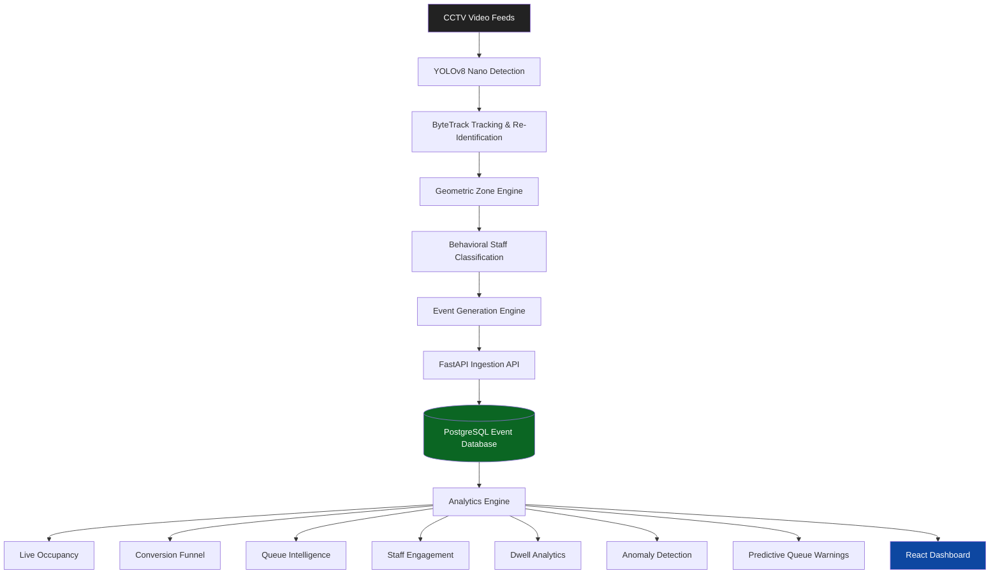

# Retail_Lens

### AI-Powered Retail Intelligence Platform

Retail_Lens is an end-to-end Computer Vision and Retail Analytics platform that transforms raw CCTV footage into actionable business intelligence. The system tracks shopper movement, measures customer engagement, detects operational bottlenecks, and provides real-time retail insights through an interactive analytics dashboard.

---

# Problem Statement

Modern retail stores generate thousands of hours of CCTV footage every month, but most of this data remains unused for operational decision-making.

Store managers often struggle to answer critical questions:

* How many customers entered the store today?
* Which areas attract the most attention?
* Are customers abandoning checkout queues?
* How effective are staff interactions?
* Where are customers dropping off before purchase?
* Can operational issues be detected before they impact revenue?

Retail_Lens addresses these challenges by converting video streams into structured behavioral events and real-time business intelligence.

---

# Key Features

### Real-Time Occupancy Tracking

Monitor active shoppers currently inside the store.

### Shopper Journey Analytics

Track the complete customer journey:

Entry → Engagement → Queue → Purchase

### Queue Intelligence

Detect queue formation, abandonment, and bottlenecks.

### Behavioral Staff Identification

Differentiate staff from customers using movement behavior instead of fragile visual uniform detection.

### Staff Engagement Analytics

Measure interactions between staff members and shoppers.

### Dynamic Zone Dwell Analysis

Track customer engagement across different store zones.

### Re-Entry Detection

Prevent duplicate counting when shoppers leave and re-enter.

### Predictive Queue Warnings

Forecast potential billing congestion before it occurs.

### Operational Anomaly Detection

Detect unusual patterns such as:

* Queue Spikes
* Conversion Drops
* Dead Zones
* Stale Camera Feeds

---

# System Architecture



---

# Architecture Layers

## Layer 1 — Edge Vision Processing

The vision pipeline processes CCTV footage locally using YOLOv8 Nano and multi-object tracking.

Responsibilities:

* Human Detection
* Tracking
* Re-Identification
* Polygon Zone Mapping
* Staff Classification
* Event Generation

---

## Layer 2 — Event Intelligence Engine

The Event Engine converts detections into business-level events.

Generated events include:

* ENTRY
* EXIT
* REENTRY
* ZONE_ENTER
* ZONE_EXIT
* ZONE_DWELL
* BILLING_QUEUE_JOIN
* BILLING_QUEUE_ABANDON

Events are transmitted in batched JSON payloads to the backend.

---

## Layer 3 — Enterprise Analytics Backend

Built with FastAPI and PostgreSQL.

Core responsibilities:

* Event Validation
* Event Storage
* Aggregation Pipelines
* Conversion Funnel Analytics
* Queue Monitoring
* Staff Metrics
* Anomaly Detection
* Predictive Intelligence

---

## Layer 4 — Retail Intelligence Dashboard

Built with React and Tailwind CSS.

Displays:

* Live Occupancy
* Staff Activity
* Staff Engagement
* Average Dwell Time
* Conversion Funnel
* Queue Metrics
* Operational Alerts

---

# Technology Stack

## Computer Vision

* YOLOv8 Nano
* OpenCV
* ByteTrack
* NumPy

## Backend

* FastAPI
* SQLAlchemy
* PostgreSQL
* Pydantic

## Frontend

* React
* Vite
* Tailwind CSS
* Recharts

## DevOps

* Docker
* Docker Compose

---

# API Endpoints

## Event Ingestion

```http
POST /events/ingest/batch
```

Supports bulk event ingestion.

---

## Live Metrics

```http
GET /stores/{id}/metrics
```

Returns:

* Occupancy
* Dwell Time
* Staff Activity

---

## Conversion Funnel

```http
GET /stores/{id}/funnel
```

Returns shopper funnel analytics.

---

## Anomaly Detection

```http
GET /stores/{id}/anomalies
```

Returns operational alerts.

---

## Heatmap Data

```http
GET /stores/{id}/heatmap
```

Returns normalized spatial coordinates.

---

## Health Monitoring

```http
GET /health
```

Monitors:

* Database Connectivity
* Feed Freshness
* Service Health

---

# How to Run

## 1. Start Infrastructure

```bash
docker compose up --build -d
```

This launches:

* PostgreSQL Database
* FastAPI Backend
* React Dashboard

---

## 2. Run Vision Pipeline

### Windows

```bash
.\pipeline\run.bat
```

### Linux / macOS

```bash
./pipeline/run.sh
```

The pipeline processes CCTV footage and streams events to the backend.

---

## 3. Open Dashboard

Navigate to:

```text
http://localhost:5173
```

Monitor:

* Live Occupancy
* Conversion Funnel
* Staff Analytics
* Queue Metrics
* Operational Alerts

---

## 4. API Documentation

Navigate to:

```text
http://localhost:8000/docs
```

---

# Testing

Run:

```bash
pytest tests/ -v
```

The test suite covers:

* Re-Entry Deduplication
* Queue Spike Detection
* Empty Store Handling
* Staff Exclusion
* Event Ingestion
* Metrics Computation

---

# Business Impact

Retail_Lens transforms passive CCTV infrastructure into an intelligent retail decision-support system.

The platform helps retailers:

* Improve customer experience
* Reduce queue-related losses
* Optimize staffing
* Increase conversion rates
* Enable data-driven decision-making

---

# Future Roadmap

* Multi-Store Analytics
* Cross-Camera ReID Enhancement
* POS System Integration
* Vision Language Models (VLMs)
* Customer Assistance Alerts
* Advanced Predictive Forecasting

---

# Author

**Rohit Singh**

Retail_Lens — Transforming CCTV Footage into Retail Intelligence.
